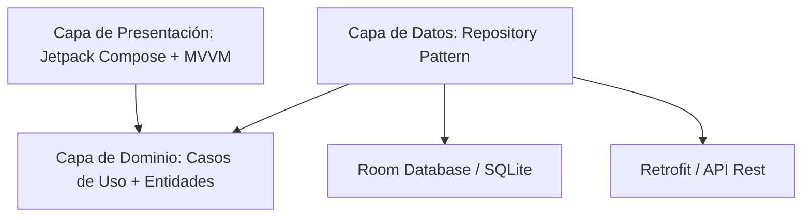

# InterRapidismo Technical Test - Android 🚚

Este proyecto es una implementación profesional de una prueba técnica para **InterRapidismo**, desarrollada en **Kotlin** bajo una arquitectura de vanguardia, enfocada en la escalabilidad, el mantenimiento y la facilidad de prueba.

---

## 🌟 Propuesta de Valor

Esta aplicación no solo cumple con los requerimientos técnicos, sino que implementa patrones de diseño modernos para demostrar un dominio avanzado del ecosistema Android:

*   **Arquitectura Limpia (Clean Architecture)**: Separación total de responsabilidades.
*   **Reactividad con Jetpack Compose**: UI declarativa de alto rendimiento.
*   **Sincronización Inteligente**: Gestión de datos offline/online mediante Room y Retrofit.
*   **Robustez**: Manejo centralizado de excepciones y errores de red.

---

## 🏗️ Arquitectura y Diseño de Software

El proyecto se basa en los principios de **Clean Architecture**, dividiendo la lógica en tres capas fundamentales para garantizar que el código sea independiente de los frameworks y fácil de testear.

### 🧩 Diagrama de Capas

### 📂 Estructura de Paquetes

| Módulo | Responsabilidad |
| :--- | :--- |
| **`domain`** | Contiene la lógica de negocio pura. Define los modelos (`models`) y las interfaces de los repositorios. Es el corazón de la aplicación y no depende de ninguna librería externa de Android. |
| **`data`** | Implementa los repositorios. Gestiona la fuente de verdad (Local vs Remota). Incluye DAOs de Room, servicios de Retrofit y mapeadores de datos. |
| **`presentation`** | Maneja la interfaz de usuario. Utiliza **ViewModels** para gestionar el estado de la UI y **Jetpack Compose** para renderizar componentes reactivos. |
| **`di`** | Implementación de **Inyección de Dependencias** mediante el patrón *Service Locator* para facilitar la provisión de instancias y mejorar la testeabilidad. |

---

## 🛠️ Stack Tecnológico

| Tecnología | Propósito |
| :--- | :--- |
| **Kotlin & Coroutines** | Programación asíncrona fluida y eficiente. |
| **Jetpack Compose** | El estándar moderno para interfaces nativas declarativas. |
| **Retrofit & OkHttp** | Consumo de APIs REST con manejo de headers y tipos. |
| **Room Persistence** | Base de datos SQLite local para soporte offline y caché. |
| **Navigation Compose** | Navegación robusta basada en grafos de estado. |
| **KSP** | Procesamiento de símbolos de Kotlin para optimizar Room. |

---

## 🚀 Implementación de Requerimientos y Casos de Uso

### 1. Capa de Seguridad
*   **Caso de Uso: Validar Versión**
    *   **Lógica**: Al iniciar, el `MainViewModel` consulta el endpoint de parámetros. Compara el valor `Versión` del API con la constante local.
    *   **Resultado**: Se muestra un mensaje en el pie de la pantalla Home indicando si está "Actualizado", "Desactualizado" o si la "Versión local es superior".
*   **Caso de Uso: Autenticación (Login)**
    *   **Lógica**: Realiza un `POST` con headers de seguridad. Si el código es 200, extrae los datos y los persiste en Room.
    *   **Resultado**: Los datos del usuario (Nombre, ID) aparecen en la tarjeta de la pantalla Home.

### 2. Capa de Datos
*   **Caso de Uso: Sincronización de Esquema**
    *   **Lógica**: Tras el login, se dispara la descarga de tablas desde el Sincronizador de Datos.
    *   **Resultado**: Se guardan en la tabla `schema_table` de SQLite.

### 3. Capa de Presentación
*   **Caso de Uso: Visualización de Localidades**
    *   **Lógica**: Al presionar "Consultar Localidades", se invoca el servicio de Localidades Recogidas.
    *   **Resultado**: Se listan las ciudades con su respectiva abreviación.

---

## 🧪 Guía de Pruebas (Step-by-Step)

Para validar la funcionalidad completa durante la sustentación, siga estos pasos:

1.  **Validación de Versión**:
    *   Observe el texto en la parte inferior de la pantalla **HOME**.
    *   Debería decir: *"Aplicativo actualizado"* (o el estado correspondiente según el API).
2.  **Prueba de Login y Persistencia**:
    *   Al abrir la app, se realiza el login automático (según requerimiento).
    *   Verifique que en la **Card de Usuario** aparezcan los datos reales retornados por el API (Usuario, ID, Nombre).
3.  **Sincronización de Tablas**:
    *   Presione el botón **"Ver Tablas Sincronizadas"**.
    *   Debería ver una lista de nombres de tablas extraídas directamente de la base de datos local (Room).
4.  **Consulta de Localidades**:
    *   Regrese al Home y presione **"Consultar Localidades"**.
    *   La app mostrará un indicador de carga y luego listará las ciudades (ej: "BOG", "MED") obtenidas del endpoint respectivo.
5.  **Manejo de Errores**:
    *   Apague el Wi-Fi/Datos del dispositivo y reinicie la app.
    *   Verifique que los mensajes de error (Try/Catch) aparezcan en pantalla indicando el problema de conexión sin que la app se detenga.

---

## 📋 Cómo Ejecutar el Proyecto

1.  Clonar el repositorio.
2.  Abrir con **Android Studio Ladybug** (o superior).
3.  Asegurarse de tener instalado **JDK 11**.
4.  Sincronizar con Gradle y ejecutar en un dispositivo con **API 24+**.

---

## 👨‍💻 Autor
**Kevin Montealegre**
*Android Developer apasionado por la arquitectura limpia y el código de alta calidad.*

---

> [!TIP]
> **Enfoque SOLID**: Cada clase tiene una única responsabilidad, facilitando la extensión de nuevas funcionalidades sin afectar la estabilidad del núcleo existente.
